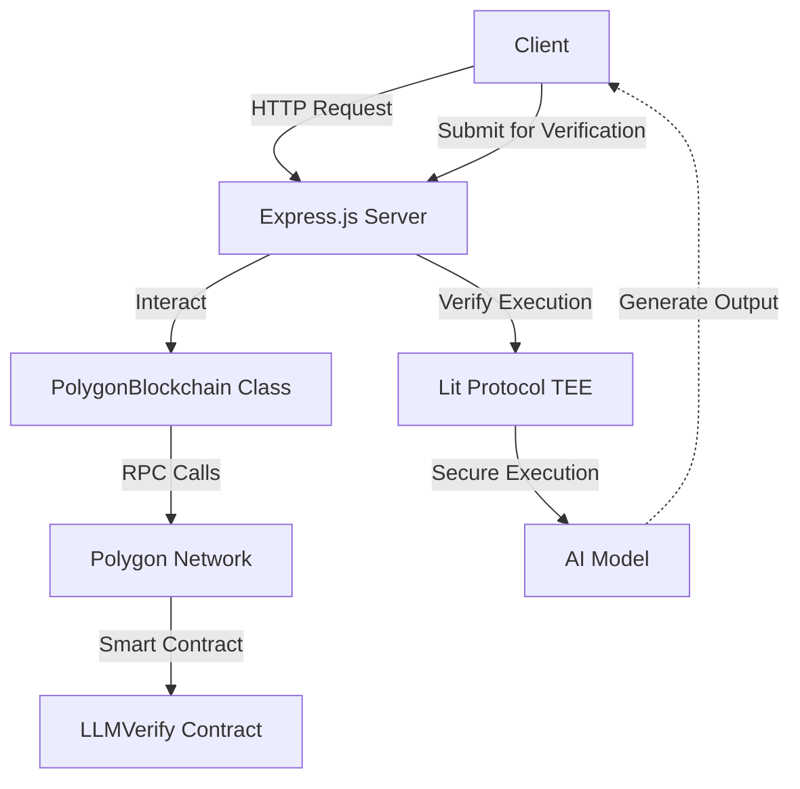

# DeepTrust.eth: AI-Powered Blockchain LLM Inference Verification

## Project Overview

LLM Verify is an innovative application that leverages AI and blockchain technology to log the intermediate computations of Large Language Model (LLM) inference in a verifiable way. The logs allow inference providers to **commit** to the calculation they performed, which can then be **verified 200x faster** by validators. By utilizing Polygon's blockchain, we ensure transparent, immutable, and decentralized storage of AI model outputs, enhancing trust and accountability in AI systems.


## Architecture Diagram



## Technologies Used

- Backend: Node.js with Express.js
- Blockchain: Polygon (zkEVM testnet)
- Smart Contract: Solidity
- Web3 Interaction: web3.js
- LLM Inference: Huggingface Transformers (widely adopted and pluggable to other inference engines)
- Secure Execution: Lit Protocol (Trusted Execution Environments)

## Setup Instructions

1. Clone the repository (repository URL to be added)
2. Install dependencies:
   ```
   npm install
   ```
3. Set up environment variables:
   - Create a `.env` file with the following:
     ```
     RPC_URL=https://rpc.cardona.zkevm-rpc.com
     CONTRACT_ADDRESS=0x82c5631aec140a6c3b90312310f74747114bfe7d
     PRIVATE_KEY=your_private_key_here
     ```
4. Start the server:
   ```
   npm start
   ```

## Smart Contract Documentation

### LLMVerify Contract

Located in `blockchain/contracts/llm_verify.sol`, this contract manages the storage and retrieval of LLM verifications.

#### Key Functions:

1. `recordVerification`: Records a new verification on the blockchain.
2. `getVerificationStatus`: Retrieves the verification status for a given entity, model, and prompt hash.

## AI Integration Details

The system is designed to work with Large Language Models. The current implementation focuses on verifying and recording the outputs of these models. Future iterations will include:

1. On-chain inference validation to check the trustworthiness of AI model outputs.
2. Integration with specific LLM APIs for real-time verification.
3. AI-powered analysis of verification patterns and anomaly detection.

## LIT Protocol Integration

LLM Verify leverages Lit Protocol's Trusted Execution Environments (TEEs) to ensure secure and isolated model executions. This integration provides several key benefits:

1. **Secure Execution**: Model inferences are performed within isolated environments, protected from external interference.
2. **Verifiable Outputs**: TEEs allow us to generate cryptographic proofs of correct execution.
3. **Tamper-Resistant**: The execution environment is resistant to manipulation, enhancing the trustworthiness of model outputs.

### Implementation Details

- We use Lit Protocol's TEEs to run our custom plugin for transformer architectures.
- The plugin intercepts the LLM prior to the head layer, allowing us to derive a deterministic term from each model.
- This process enables us to verify the integrity of model outputs without compromising the model's security.


## Blockchain Integration

The project leverages Polygon's zkEVM testnet for several key benefits:

1. **Scalability**: Polygon's Layer 2 solution allows for faster and cheaper transactions compared to Ethereum mainnet.
2. **Security**: The zkEVM provides the security guarantees of Ethereum while improving performance.
3. **Interoperability**: Easy integration with Ethereum ecosystem tools and wallets.

### PolygonBlockchain Class

This class (`blockchain/polygonBlockchain.js`) encapsulates the logic for interacting with the Polygon network:

- `checkContract()`: Verifies the deployment and functionality of the smart contract.
- `recordVerification()`: Sends a transaction to record verification data on the blockchain.
- `getVerificationStatus()`: Retrieves verification status from the blockchain.

## Verification Process

1. Client sends an inference request to the server.
2. Server randomly selects 2-5% of requests for verification.
3. Selected requests are sent to Lit Protocol's TEEs for secure execution.
4. The TEE generates a verifiable output and cryptographic proof.
5. The server compares this output with the one provided by the inference provider.
6. Results are recorded on the Polygon blockchain using the LLMVerify smart contract.

## Tokenomics and Incentive System

To ensure the integrity of the verification network, we've implemented a token-based incentive system:

1. Inference clients must stake tokens to participate in the network.
2. Honest participants see their trust scores increase and are rewarded with tokens.
3. Detected dishonesty results in slashing of staked tokens.
4. This system creates a strong economic incentive for honest behavior.


## Usage Guide

### Recording a Verification

Send a POST request to `/verify`:

```json
{
  "prompt": "What is the capital of France?",
  "claimedHash": "0x123...",
  "entity": "OpenAI",
  "model": "GPT-4"
}
```

### Retrieving Verification Status

Send a GET request to `/verification-status` with query parameters:

```
/verification-status?entity=OpenAI&model=GPT-4&promptHash=0x456...
```

## Future Roadmap

1. Implement on-chain cross-validation of AI model outputs.
2. Develop a token-based incentive model for data providers and validators.
3. Create AI agents for automated on-chain operations and fraud detection.
4. Expand to support multiple AI models and blockchain networks.
5. Develop a user-friendly front-end interface for easy interaction with the system.

## How This Project Meets Polygon's Qualification Requirements

1. **AI Integration**: Our system integrates AI by verifying and recording the outputs of Large Language Models on the blockchain, with plans for on-chain inference validation.

2. **Use of Blockchain**: We leverage Polygon's zkEVM for secure, scalable, and transparent storage of AI model verifications, enhancing trust in AI systems.

3. **Documentation**: This comprehensive documentation provides setup instructions, architecture diagrams, and detailed explanations of both the AI and blockchain components.

4. **Innovation and Utility**: LLM Verify introduces a novel mechanism for ensuring accountability in AI systems, addressing the critical need for transparency in AI outputs.

5. **Consumer Approach**: By providing a simple API for verifying AI outputs, we make it easy for developers and end-users to integrate trustworthy AI into their applications.

6. **Security and Privacy**: By integrating Lit Protocol's TEEs, we ensure secure and private execution of AI models, adding an extra layer of trust to our verification system.

7. **Scalability**: The combination of Polygon's efficient blockchain and Lit Protocol's TEEs allows our system to handle a high volume of verifications without compromising on security or speed.
